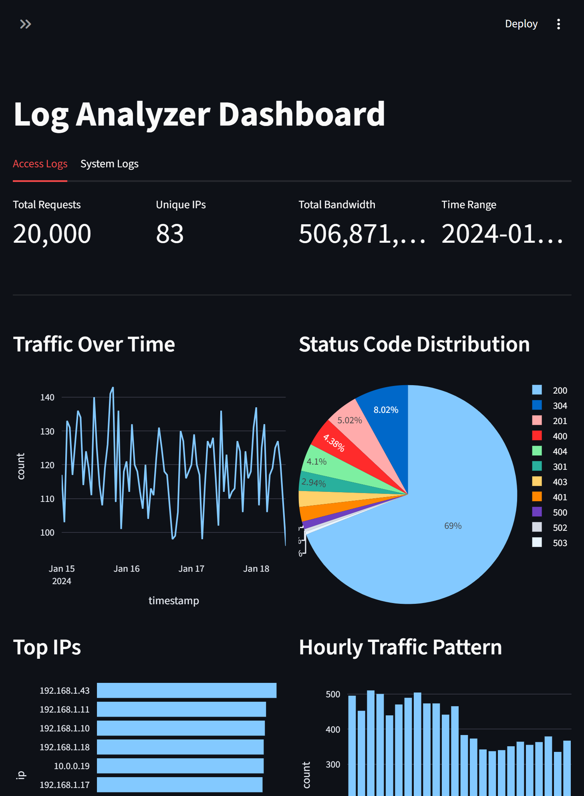

# Log Analyzer

Server log analysis tool that parses multiple log formats (nginx, apache, syslog, SSH), provides traffic and system analytics, detects anomalies, and offers real-time monitoring. Includes CLI, REST API, and interactive dashboard.



## What does it do?

- Parses 10 log formats: nginx combined, apache common, apache error, syslog (Linux/SSH), HDFS, Hadoop, Spark, Zookeeper, Windows Event, OpenStack
- Stores parsed data in SQLite for fast querying
- Analyzes access logs: traffic patterns, top IPs, paths, status codes, bandwidth
- Analyzes system logs: event distribution, log levels, top sources, error trends
- Detects anomalies using z-score statistical analysis (traffic spikes, error bursts, suspicious IPs)
- Monitors log files in real-time with watchdog
- Provides interactive Plotly charts via Streamlit dashboard with separate tabs for access and system logs

## Installation

Requires Python 3.11+

```bash
pip install -r requirements.txt
```

## Quick Start

1. Generate sample log data:
```bash
python scripts/generate_logs.py
```

2. Parse logs into database:
```bash
python src/cli.py parse logs/access.log
```

3. View summary:
```bash
python src/cli.py summary
```

## Usage

### CLI

```bash
python src/cli.py parse logs/access.log    # Parse log file
python src/cli.py summary                  # Traffic summary
python src/cli.py anomalies                # Detect anomalies
python src/cli.py watch logs/access.log    # Real-time monitoring
python src/cli.py resetdb                  # Clear database
```

**Example output:**
```
Detected format: nginx_combined
Inserted 10000 entries into database.
```

```
Total requests : 10,000
Unique IPs     : 80
First entry    : 2024-01-15T00:00:12+00:00
Last entry     : 2024-01-21T23:59:48+00:00
Total bytes    : 252,481,024

Top IPs:
  45.33.32.156             542
  192.168.1.23             189
  192.168.1.7              176

Status Codes:
  200    7012
  304     801
  404     423
  401     215
  500     112
```

### REST API

```bash
python src/api.py
```

Starts the server at `http://localhost:8000`. Swagger docs at `http://localhost:8000/docs`.

**Endpoints:**

| Endpoint | Method | Description |
|---|---|---|
| `/health` | GET | Server health check |
| `/summary` | GET | Access log summary |
| `/summary/system` | GET | System log summary |
| `/top/ips` | GET | Top IP addresses |
| `/top/paths` | GET | Top request paths |
| `/top/sources` | GET | Top log sources (sshd, apache, etc.) |
| `/status-codes` | GET | HTTP status code distribution |
| `/levels` | GET | Log level distribution (error, info, etc.) |
| `/traffic` | GET | Traffic over time |
| `/errors` | GET | Error rate over time |
| `/system/events` | GET | System events over time |
| `/system/errors` | GET | System errors over time |
| `/anomalies` | GET | Detect anomalies |

To enable API key protection, set `API_KEY=your-secret-key` in your `.env` file. When active, include the `X-API-Key` header in requests.

**Examples:**

```bash
curl http://localhost:8000/summary
```
```json
{"total": 10000, "unique_ips": 80, "first_entry": "2024-01-15T00:00:12+00:00", "last_entry": "2024-01-21T23:59:48+00:00", "total_bytes": 252481024}
```

```bash
curl http://localhost:8000/top/ips?limit=3
```
```json
[{"ip": "45.33.32.156", "count": 542}, {"ip": "192.168.1.23", "count": 189}, {"ip": "192.168.1.7", "count": 176}]
```

### Streamlit Dashboard

```bash
streamlit run src/app.py
```

Opens at `http://localhost:8501`. Features interactive Plotly charts in two tabs: Access Logs (traffic timeline, status codes, top IPs, hourly patterns, error rates, bandwidth) and System Logs (events timeline, log levels, top sources, hourly patterns, error trends). Supports file upload.

### Docker

```bash
docker-compose -f docker/docker-compose.yml up --build
```

API runs at `http://localhost:8000`, Dashboard at `http://localhost:8501`.

### Tests

```bash
pytest tests/ -v
```

## Configuration

Copy `.env.example` to `.env` and adjust:

| Variable | Default | Description |
|---|---|---|
| `API_HOST` | 0.0.0.0 | API server address |
| `API_PORT` | 8000 | API port |
| `LOG_LEVEL` | INFO | Log level |
| `RATE_LIMIT` | 60/minute | API rate limit |
| `DB_PATH` | data/log_analyzer.db | SQLite database path |
| `API_KEY` | (empty) | API key (auth disabled when empty) |
| `ANOMALY_THRESHOLD` | 2.0 | Z-score threshold for anomaly detection |

## Project Structure

```
log-analyzer/
├── Makefile
├── pyproject.toml
├── .pre-commit-config.yaml
├── requirements.txt
├── .env.example
├── README.md
├── src/
│   ├── cli.py           # Click CLI
│   ├── api.py           # FastAPI REST API
│   ├── app.py           # Streamlit dashboard
│   ├── parser.py        # Regex log parser
│   ├── database.py      # SQLite storage
│   ├── analyzer.py      # Pandas traffic analytics
│   ├── anomaly.py       # Z-score anomaly detection
│   ├── watcher.py       # Real-time log monitoring
│   ├── config.py        # Configuration
│   └── logger.py        # Logging
├── docker/
│   ├── Dockerfile
│   └── docker-compose.yml
├── scripts/
│   └── generate_logs.py # Sample data generator
├── tests/
│   ├── conftest.py
│   ├── test_parser.py
│   ├── test_database.py
│   ├── test_analyzer.py
│   ├── test_anomaly.py
│   └── test_api.py
├── data/
│   └── log_analyzer.db  # SQLite database
└── logs/
    └── access.log       # Log files
```

## Technical Details

- **Log Parsing:** Regex-based parser supporting 10 formats: nginx combined, apache common, apache error, syslog, HDFS, Hadoop, Spark, Zookeeper, Windows Event, OpenStack
- **Storage:** SQLite with indexed columns for fast querying
- **Analytics:** Pandas for traffic analysis, aggregation, and time-series resampling
- **Anomaly Detection:** Z-score statistical method for detecting traffic spikes, error bursts, and suspicious IPs
- **Real-time:** watchdog file system monitoring with incremental parsing
- **Visualization:** Plotly interactive charts (line, bar, pie, area)
- **CLI:** Click framework with multiple commands
- **API:** FastAPI + rate limiting + CORS + API key auth
- **CI/CD:** GitHub Actions automated testing
- **Code Quality:** black + flake8 + isort + pre-commit hooks
- **Container:** Docker + docker-compose

## Requirements

- pandas
- numpy
- plotly
- click
- watchdog
- fastapi
- uvicorn
- python-dotenv
- slowapi
- streamlit
- pytest
- httpx
- black
- flake8
- isort
- pre-commit
